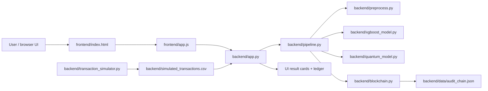

# Fraud Detection Simulation Explained

This project is a simple demo of a fraud detection pipeline that mixes:

- a classical model (XGBoost)
- a quantum model (PennyLane VQC)
- a blockchain-style audit trail
- a live browser UI that shows the process step by step

The goal is to make the system easy to understand: a transaction is generated, checked for risk, scored, logged, and shown in the UI.

---

## 1) Simple connection map



### In plain words

- The browser UI lives in [frontend/index.html](frontend/index.html) and [frontend/app.js](frontend/app.js).
- The API server lives in [backend/app.py](backend/app.py).
- The logic pipeline lives in [backend/pipeline.py](backend/pipeline.py).
- The simulator generates new fake transactions in [backend/transaction_simulator.py](backend/transaction_simulator.py).
- The generated data is stored in [backend/simulated_transactions.csv](backend/simulated_transactions.csv).
- The backend reads that data and sends decisions back to the UI.

---

## 2) How the simulation works

### Step 1: Transaction simulator creates fake data

The file [backend/transaction_simulator.py](backend/transaction_simulator.py) runs a loop that creates fake transactions every 10 seconds.

It generates data like:

- amount
- hour of the day
- device type
- IP risk score
- new merchant flag
- distance from home
- transaction velocity in the last 1 hour
- average historical amount
- merchant category
- city

This is not real banking data. It is synthetic data made to look realistic.

The simulator does two kinds of transactions:

- normal transactions (about 80%)
- suspicious transactions (about 20%)

It saves the latest transactions into [backend/simulated_transactions.csv](backend/simulated_transactions.csv).

### Step 2: The UI polls for live transactions

The frontend keeps checking the backend for a new transaction.

In [frontend/app.js](frontend/app.js):

- the app calls the endpoint /api/live-transaction
- the backend reads the latest row from the CSV
- the front-end fills the form with that data
- it submits that transaction to the prediction pipeline

So the live feed is basically:

simulator -> CSV -> backend -> UI -> prediction pipeline

---

## 3) How the backend connects to the UI

The Flask app in [backend/app.py](backend/app.py) is the bridge between the browser and the machine-learning logic.

### Important API endpoints

- POST /api/predict
  - Takes a transaction from the form
  - Runs the full pipeline
  - Returns stage-by-stage result + final decision

- GET /api/live-transaction
  - Reads the newest simulated transaction from the CSV
  - Used by the live UI feed

- GET /api/sample?mode=...
  - Returns example transactions for legit, fraud, uncertain, or random scenarios

- GET /api/audit-log
  - Returns blockchain entries for the UI ledger

- GET /api/audit-log/verify
  - Recomputes the hash chain to check if data was changed

- GET /api/meta
  - Gives dropdown options like device types, merchant types, and city names

The UI uses these endpoints to build the experience you see in the browser.

---

## 4) How the fraud pipeline works

The main orchestration happens in [backend/pipeline.py](backend/pipeline.py).

The pipeline runs in this order:

1. Input / raw transaction received
2. Data preprocessing
3. XGBoost risk check
4. Quantum model only if needed
5. Blockchain audit log

### 4.1 Input stage

The raw transaction is accepted from the form or from the simulator.

The raw data is stored as a dictionary with fields such as:

- amount
- device_type
- city
- ip_risk_score
- txn_velocity_1h
- distance_from_home_km
- avg_historical_amount

### 4.2 Preprocessing stage

The file [backend/preprocess.py](backend/preprocess.py) cleans the input and creates engineered features.

Examples:

- amount_deviation
- is_night_txn
- is_high_value
- velocity_risk
- device_risk

These values help the model understand weird patterns like:

- very high amount compared to normal spending
- transaction at unusual night hour
- new device or suspicious IP
- unusual transaction speed

### 4.3 XGBoost stage

The classical model lives in [backend/xgboost_model.py](backend/xgboost_model.py).

It trains a gradient-boosted decision tree model using synthetic data.

It gives a risk score between 0 and 1.

The logic is simple:

- below 0.30 = LOW risk
- above 0.70 = HIGH risk
- between 0.30 and 0.70 = UNCERTAIN

If the score is clearly low or clearly high, the system decides immediately.

If it is uncertain, it sends the transaction to the quantum model.

### 4.4 Quantum stage

The quantum model is in [backend/quantum_model.py](backend/quantum_model.py).

This is only used for the ambiguous cases.

It takes 4 important features:

- amount_deviation
- ip_risk_score
- velocity_risk
- device_risk

It encodes those values into angles for a 4-qubit variational quantum circuit.

Then:

- rotations are applied to the qubits
- CNOT gates entangle them
- measurement is taken from PauliZ on the first qubit
- the result is converted to a score between 0 and 1

If the quantum score is above 0.5, it is treated as fraud. Otherwise it is treated as safe.

This gives the model a second opinion only when the classic model is unsure.

### 4.5 Blockchain audit stage

Everything is recorded in [backend/blockchain.py](backend/blockchain.py).

It creates a local hash-chained ledger and stores it in [backend/data/audit_chain.json](backend/data/audit_chain.json).

Each block contains:

- index
- timestamp
- transaction hash
- decision
- previous hash
- current block hash

The important idea is this:

- each block references the previous block hash
- if any earlier block is modified, the chain breaks
- the verification endpoint checks the entire chain for tampering

This makes the audit record tamper-evident.

---

## 5) How the UI shows all of this

The front-end in [frontend/index.html](frontend/index.html) and [frontend/app.js](frontend/app.js) shows the pipeline as a visual flow.

Each stage is represented like this:

- Transaction Data Input
- Preprocessing
- XGBoost Model
- Quantum Model
- Blockchain Audit & Logging

As the backend returns each stage result, the UI:

- highlights the current stage
- fills in detail cards
- shows scores and thresholds
- draws the quantum circuit
- updates the decision box
- refreshes the ledger

So the user can literally watch the transaction move through the system.

---

## 6) Full end-to-end flow

Here is the easiest way to understand the whole project:

1. The simulator creates a transaction.
2. The CSV stores it.
3. The frontend polls for the latest transaction.
4. The UI fills the form.
5. The browser sends a POST request to /api/predict.
6. The Flask backend calls the pipeline.
7. The raw transaction is cleaned and engineered.
8. XGBoost scores the transaction.
9. If the score is uncertain, the quantum VQC re-scores it.
10. The final decision is logged to the blockchain ledger.
11. The UI renders the result and the audit trail.

---

## 7) Very simple decision logic

```text
score = XGBoost(transaction)

if score <= 0.30:
    decision = APPROVE
elif score >= 0.70:
    decision = BLOCK
else:
    quantum_score = QuantumModel(transaction)
    if quantum_score > 0.5:
        decision = BLOCK
    else:
        decision = APPROVE
```

That is the core of the system.

---

## 8) Final explanation in one paragraph

This project is a mini fraud-detection demo where fake transactions are generated, scored by a classical model, optionally re-checked by a quantum model, and then recorded in a tamper-evident blockchain log. The frontend is only the visual layer; the real logic lives in the backend. The simulator creates realistic business-like events, the API exposes them to the UI, the pipeline processes them step by step, and the audit ledger keeps record of every decision so the system can be inspected and verified.

---

## 9) File map summary

- [frontend/index.html](frontend/index.html) — UI layout
- [frontend/app.js](frontend/app.js) — connection logic, polling, rendering, form actions
- [backend/app.py](backend/app.py) — Flask API endpoints
- [backend/pipeline.py](backend/pipeline.py) — end-to-end orchestration
- [backend/preprocess.py](backend/preprocess.py) — feature engineering
- [backend/xgboost_model.py](backend/xgboost_model.py) — classical risk model
- [backend/quantum_model.py](backend/quantum_model.py) — VQC re-scoring model
- [backend/blockchain.py](backend/blockchain.py) — audit chain logic
- [backend/transaction_simulator.py](backend/transaction_simulator.py) — live synthetic transaction generator
- [backend/simulated_transactions.csv](backend/simulated_transactions.csv) — latest generated transactions
- [backend/data/audit_chain.json](backend/data/audit_chain.json) — audit log

If you want, this same explanation can also be turned into a shorter version for a presentation slide or project README.
